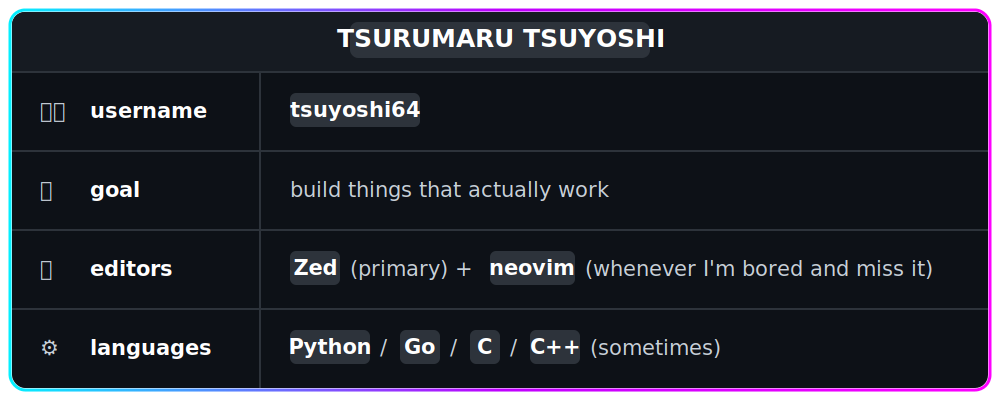
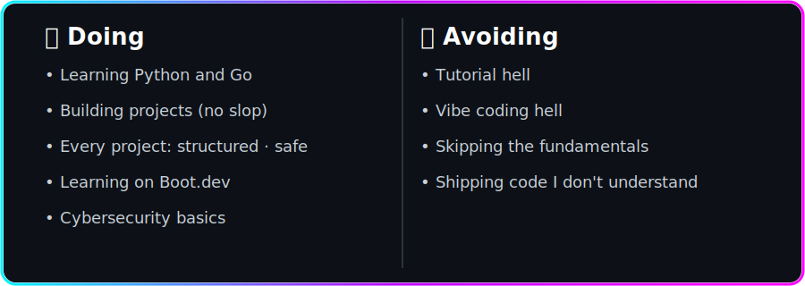
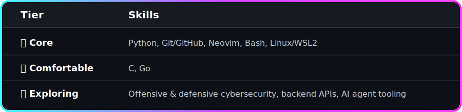

  

  

 

  
  &nbsp;
  

 

  

  

  

  <h3><samp><b>The name I use is <i>Tsurumaru Tsuyoshi</i>, but you can call me <i>"Tsu"</i>.</b></samp></h3>
  <h3><samp><b>I build small projects with Python (aiming to Go).</b></samp></h3>
  <h3><samp>I'm currently into CLI tools, and I'm planning to build more, and I'm still learning to do so.</samp></h3>

  
<samp>🎓 Studying <a href="https://boot.dev"><b>Boot.dev</b></a> &nbsp;|&nbsp; 🚀 Code</samp>

  

  

  

  

  

  

<samp>Yes I'm using <i>Windows</i>, with <i>WSL 2</i> for dev (´-ω-`).</samp>

<samp><i>P.S.</i> I can't find the <b>Zed</b> icon TT.</samp>

<samp><b>🌳 &nbsp;Click to expand the skill tree</b></samp>

 

  

  

  

  <table width="900">
    <tr>
      <td width="50%">
        
      </td>
      <td width="50%">
        
      </td>
    </tr>
  </table>

 

  <table width="1200">
    <tr>
      <td>
        
      </td>
      <td>
        
      </td>
    </tr>
  </table>

 

  

  

  

  <h2><samp><b>Oh! I'm currently learning on <a href="https://www.boot.dev/u/tsuyoshi64">Boot.dev</a> too, it's amazing!</b></samp></h2>

  

  

  
<samp><b>&nbsp;Hmm, someone said they've heard the <i>Tsuyoshi</i> name before...</b></samp>

   
  

    <samp><em>Yes. I am Tsurumaru Tsuyoshi from Umamusume: Pretty Derby.</em></samp>
     
    <samp><em>*Everyone shocked sfx*</em></samp>
     
    <samp><em>....Anyway, thank u for visiting this profile ^^</em></samp>
  

   

 

  

